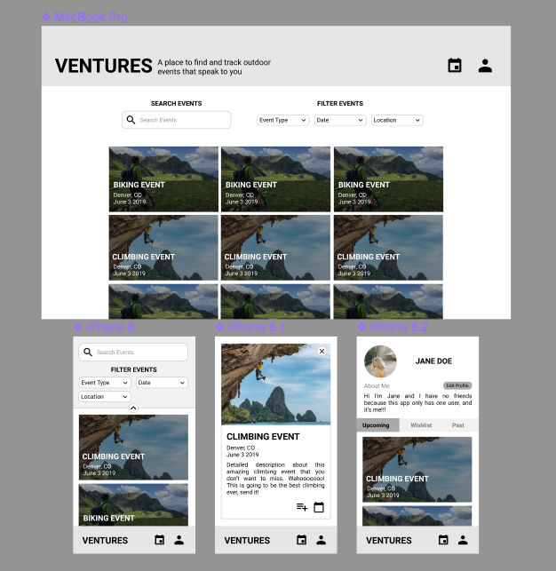

# Ventures
Ventures is a 4 person group project for Module 4 at the [Turing School of Software & Design](https://turing.io/). It is a cross-pollination project with two students from the [Front-End Engineering Program](https://turing.io/programs/front-end-engineering/) and two students from the [Back-End Engineering Program](https://turing.io/programs/back-end-engineering/).The project specifications can be found [here](http://backend.turing.io/module4/projects/cross_pollination/cross_pollination_spec).

Ventures is an application to allow outdoor enthusiasts to browse outdoor festivals and events. You can browse through a variety of climbing, mountain biking, hiking, running, and white water rafting events all throughout the US. Each card gives more details including the start/end dates, a link to the events website, an accompanying photo and YouTube video, as well as buttons for the you to add that event to your ‘wishlist’ or ‘attending’ lists. Your profile page allows you to edit your user name and personal bio as well as view events filtered by upcoming events, wish-listed events, and past events you’ve attended. Ventures is here to help you find the right events for you! The link to the Ventures deployed Frontend can be found [here](https://ventures-turing.herokuapp.com/). The link to the Ventures Backend API can be found [here](https://ventures-be.herokuapp.com/api/v1/events) along with the [github repo](https://github.com/mgoodhart5/ventures-be). We used waffle.io for our [kanban board](https://waffle.io/whitneyburton/ventures-fe). 

### Preview 

### Set-Up:   
#### Front-end  
Clone this repo by running: `git clone https://github.com/whitneyburton/ventures-fe.git`
Run: `npm install` from the root directory
Run: `npm start` and visit localhost:3001 in your browser  

#### Back-end
(Associated backend repo can be found [here](https://github.com/mgoodhart5/ventures-be)).

Clone this repo by running: `git clone https://github.com/mgoodhart5/ventures-be.git`  
Run: `npm install` from the root directory  
Run: `npm start` and visit localhost:3000/api/v1/events in your browser to see all events.
Further directions for other endpoints are listed on the backend repo's README.

### Front-End Tech Stack:
* React & React Hooks
* Redux
* React Router
* JavaScript
* SCSS

### Testing:
* Jest and Enzyme. 
Run `npm test` from the associated root directory.

### Original Assignment: 
[Cross Pollination Capstone Project](http://frontend.turing.io/projects/capstone.html) through [Turing School of Software & Design](https://turing.io/).

### Contributors
**[Karin Ohman](https://github.com/kaohman)**

**[Whitney Burton](https://github.com/whitneyburton)**

**[Anna Smolentzov](https://github.com/asmolentzov)**

**[Mary Goodhart](https://github.com/mgoodhart5)**

### Wireframes:
Created with [Figma](https://www.figma.com/file/HT6bEdxRt724UmLwjYzNW0iS/Ventures?node-id=12%3A0)

This project was bootstrapped with [Create React App](https://github.com/facebook/create-react-app).
